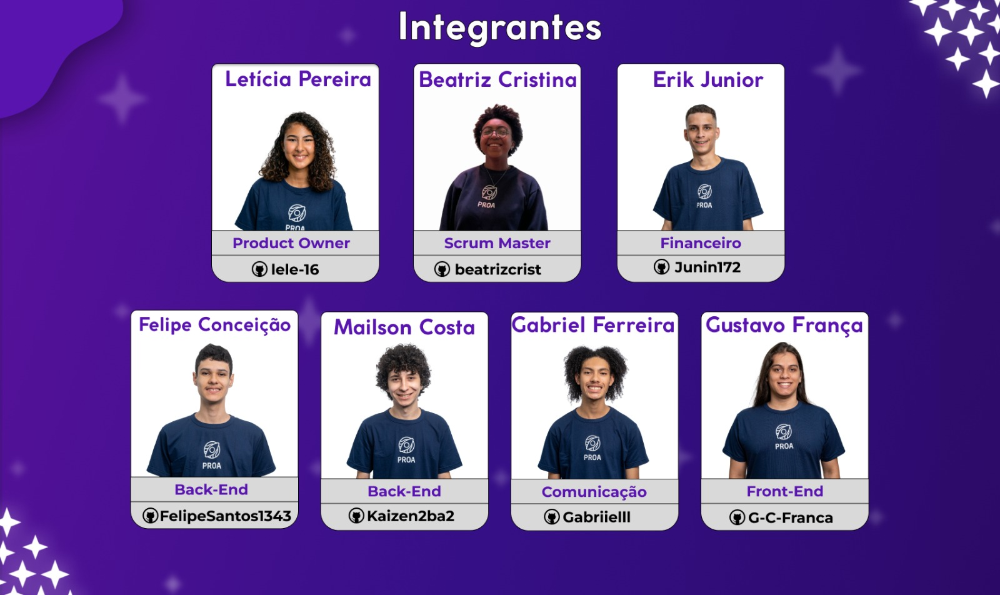

# IndieWise

## Valorização e compartilhamento de todo conhecimento

### Por que?

Você já se perguntou por que muitas vezes o conteúdo das aulas no ambiente escolar é transmitido de forma padronizada e engessada? Será que todos os estudantes aprendem da mesma maneira e ao mesmo ritmo? E o mais importante, será que todos possuem os mesmos interesses?

### A nossa ideia

Com o objetivo de proporcionar um ambiente onde aprender pode ser algo divertido e interessante, a IndieWise surge com o propósito de valorizar todos os tipos de conhecimento, reunindo pessoas com diversas aptidões e interesses para que juntos busquem formas criativas de ensinar e aprender.

### Tecnologias

1. Front-end
   - HTML5
   - CSS
   - JavaScript
2. Back-end
   - Java
   - Spring Boot
3. Banco de dados
   - MongoDB
4. Hospedagem
   - Railway

### Integrantes

### Links

1. Protótipo:
 - https://www.figma.com/file/bXONaH4J4xNAEOXOPtj38r/Prototipo?type=design&node-id=184-321&mode=design&t=DTYppaDhQ5nL9hXY-0
3. Site no Railway:
   - [https://indiewise-back-end-main-production.up.railway.app/indiewise.com.br](https://indiewise-back-end-main-production.up.railway.app/indiewise.com.br)
4. LinkTree:
   - [https://linktr.ee/indie.wise](https://linktr.ee/indie.wise)
